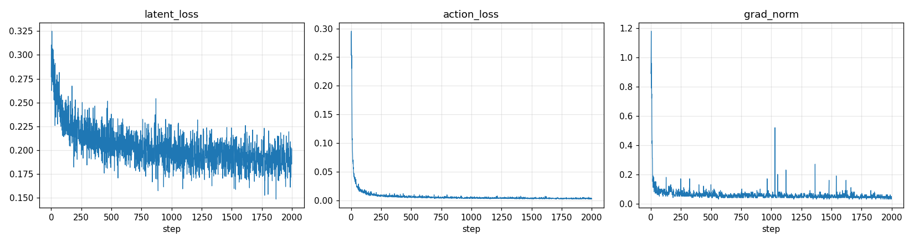

# LingBot-VA Validation Run 报告(2000 步)

> **平台**:8 × BW1000_H(单卡 63G)· 1 节点 · 300C / 2000G
> **软件栈**:torch 2.7.1 · RCCL/NCCL 2.22.3 · flex_attention(compiled)· FSDP2
> **任务**:RoboTwin post-training 端到端验证(robotwin_train_val,与正式训练同配置、更短步数)+ i2va 评测
> **训练区间**:2026-10-02 10:24:35 → 2026-10-03 11:54:15(25h27m)
> **结论**:✅ 全流程跑通;训练 2000/2000 步,checkpoint ✔,i2va demo ✔
> **生成时间**:2026-10-03 11:58(由 script/gen_final_report.py 自动生成)

---

## 目录

1. [执行摘要](#1-执行摘要)
2. [训练速度与时间](#2-训练速度与时间)
3. [训练 Loss](#3-训练-loss)
4. [资源占用](#4-资源占用)
5. [Checkpoint 与评测结果](#5-checkpoint-与评测结果)
6. [复现命令速查](#6-复现命令速查)

---

## 1. 执行摘要

| 维度 | 结果 |
|---|---|
| 训练完成度 | ✅ 2000 / 2000 步(25h27m) |
| 数值健康 | ✅ NaN 0 次,grad_norm 最大 1.18(clip 2.0)|
| Loss 变化 | latent 0.2769→**0.2016**(-27.2%);action 0.2535→**0.0030**(-98.8%)|
| Checkpoint | ✅ `/home/tione/notebook/code/lingbot-va/train_out_val/checkpoints/checkpoint_step_2000` |
| i2va 评测 | ✅ `/home/tione/notebook/code/lingbot-va/train_out_val/eval/demo_step_2000.mp4`(77 帧, 7.7s, 320×384) |

## 2. 训练速度与时间

| 指标 | 实测值 |
|---|---|
| 稳态速度 | **45.83 s/optimizer step**(tqdm 末行)|
| 总时长 | 25h27m(2000 步)|
| GPU 拓扑 | 1 节点 × 8 卡 = 8 卡 |
| 有效 batch | 32(8 卡 × batch 1 × grad_accum 4)|
| 吞吐 | **0.6982 samples/s**(全卡合计)|

## 3. 训练 Loss



### 里程碑(10 步窗口均值)

| step | latent_loss | action_loss | grad_norm |
|---:|---:|---:|---:|
| 0 | 0.2887 | 0.2701 | 0.996 |
| 222 | 0.2253 | 0.0082 | 0.067 |
| 444 | 0.2066 | 0.0062 | 0.059 |
| 666 | 0.2054 | 0.0049 | 0.054 |
| 888 | 0.1969 | 0.0041 | 0.052 |
| 1111 | 0.1957 | 0.0039 | 0.050 |
| 1333 | 0.1945 | 0.0037 | 0.055 |
| 1555 | 0.1918 | 0.0033 | 0.050 |
| 1777 | 0.1831 | 0.0031 | 0.050 |
| 1999 | 0.1900 | 0.0029 | 0.040 |

### 判读

- **latent_loss**:0.2769 → 0.2016(-27.2%)
- **action_loss**:0.2535 → 0.0030(-98.8%)
- **NaN 次数**:0;**grad_norm 峰值**:1.18(< clip 2.0 为健康)
- 无 validation loss(官方代码无验证循环);质量验证依赖 i2va 生成评测

## 4. 资源占用

| 资源 | 值 |
|---|---|
| 显存峰值(训练期采样)| 56610 MiB / 63 GB × 8 卡 |
| CPU / 内存 | 300C / 2000G(单节点)|
| 基座模型 | `/home/tione/notebook/model/lingbot-va-base` |
| 数据集 | `/home/tione/notebook/data/robotwin-clean-and-aug-lerobot/lerobot_robotwin_eef_aug_500` |

## 5. Checkpoint 与评测结果

| checkpoint | i2va demo | 说明 |
|---|---|---|
| step_2000 | `eval/demo_step_2000.mp4`(77 帧, 7.7s, 320×384) | ✅ |

- 评测管线:`bash script/eval_checkpoint.sh 2000`(自动组目录、patch attn_mode、独立端口)
- 评测日志:`/tmp/validation_eval.log`

## 6. 复现命令速查

```bash
# 0) 环境(每 shell)
source /opt/dtk/env.sh
cd /home/tione/notebook/code/lingbot-va

# 1) 重跑本验证(2000 步 + 自动评测 + 自动出本报告)
bash script/run_validation.sh 2000

# 2) 单独评测 checkpoint 2000
bash script/eval_checkpoint.sh 2000

# 3) 单独重新生成本报告
REPORT_SAVE_ROOT=/home/tione/notebook/code/lingbot-va/train_out_val REPORT_VAL_STEPS=2000 \
  REPORT_NGPU=8 REPORT_NNODES=1 \
  va_env/bin/python script/gen_final_report.py
```

---

*相关文档:`final_report.md`(10K 正式训练总报告)、`PROJECT.md`(平台适配分析)、`report.md`(快照流水)。本报告由验证管线自动生成。*
