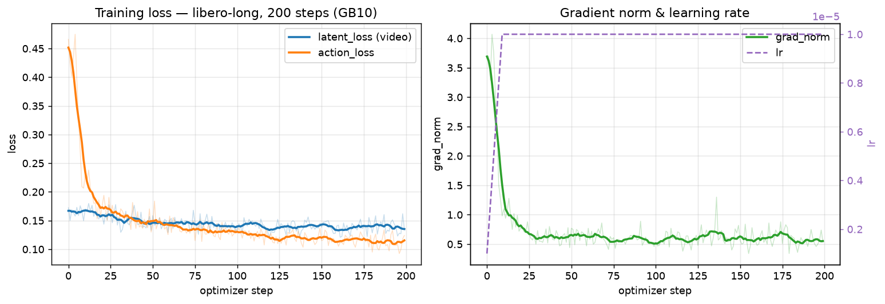

# LingBot-VA Post-Training 运行报告(DGX Spark / GB10 平台)

> 目标:在 NVIDIA DGX Spark(GB10,128GB 统一内存)上打通 LingBot-VA Post-Training 全链路,
> 完成 libero-long 数据集 200 步验证性训练。
> 结论先行:**方案 B(解耦 loader)实施成功,200 步训练完整跑通,checkpoint 正常落盘,
> 并用 checkpoint_step_200 完成 i2va 推理闭环验证**;
> 期间发现并修复 2 个平台级问题(Pool fork 死锁、保存 checkpoint 时宿主机 OOM)。

---

## 1. 运行信息

| 项目 | 值 |
|---|---|
| 机器 | NVIDIA DGX Spark,GB10 Grace Blackwell(sm_121),128GB 统一内存,20-core Arm aarch64 |
| 驱动 / CUDA | 580.173.02 / CUDA 13.0 |
| 软件栈 | conda 环境 `lerobot`:Python 3.13.15,torch 2.11.0+cu130,diffusers 0.40.0,transformers 5.17.0,lerobot 0.6.2(仅共存,训练链路已不依赖),pyarrow 25.0.1 |
| 训练框架 | FSDP2 fully_shard + MixedPrecisionPolicy(bf16)/ flex_attention(torch.compile)/ 激活检查点 / fused AdamW |
| 启动命令 | `NGPU=1 CONFIG_NAME='libero_train' bash script/run_va_posttrain.sh` |
| 训练日志 | `train_out/train_200.log`(第 2 次,成功)、`train_out/train_200_run1_oom.log`(第 1 次,保存时 OOM) |
| 内存监控 | `train_out/mem_monitor.log`(每 2 分钟采样) |

## 2. 数据与模型(均从 ModelScope 下载)

| 项目 | 值 |
|---|---|
| 底座模型 | `modelscope download --model Robbyant/lingbot-va-base` → `~/works/dataset/lingbot-va-base`(23G;transformer 5B bf16,`attn_mode` 已是 `"flex"`,无需修改) |
| 数据集 | `modelscope download --dataset Robbyant/libero-long-lerobot` → `~/works/dataset/libero-long-lerobot`(libero_10.tgz 467M,解压后 4.9G) |
| 数据规模 | LeRobot v2.1,500 episodes / 138,090 帧,Franka;`meta/episodes.jsonl` 含 `action_config` ✅;`latents/` 已预提取(Wan2.2 VAE,48 维,双相机 agentview + eye_in_hand,128×128) |
| empty_emb.pt | 归档中不含;已用底座 UMT5 text_encoder 对空字符串编码生成(与 server `_get_t5_prompt_embeds` 逻辑一致,(512, 4096) bf16,有效 token=1),置于数据集根目录 |

## 3. 方案 B:loader 与 lerobot 解耦(核心改造)

`wan_va/dataset/lerobot_latent_dataset.py` 重写为**不依赖 lerobot 包**的独立读取器
(解决 lerobot 0.6.2/v3.0 与官方 v2.1 数据集的格式代差,见 project.md 11.4):

| 原实现(lerobot 耦合) | 新实现(方案 B) |
|---|---|
| `LeRobotDataset` 子类 + `LeRobotDatasetMetadata` | 纯 `torch.utils.data.Dataset` |
| `get_episode_data_index`(0.6.2 已移除) | 按 `episodes.jsonl` 的 `length` 自行累加构建 from/to 索引 |
| `meta.get_episode_chunk()`(已移除) | `episode_index // chunks_size`(chunks_size 读自 `meta/info.json`) |
| `meta.episodes.items()`(v3.0 变 HF Dataset) | 直接逐行解析 `meta/episodes.jsonl`(含自定义 `action_config`) |
| `load_hf_dataset()` 全量 HF dataset | pyarrow 按 `data_path` 模板逐 episode 读 parquet,仅取 `action` 列拼接(500 ep ≈ 1s,~4MB) |
| `packaging` / `get_safe_version` 未导入(历史 NameError) | 相关代码路径删除,bug 消除 |

视频侧本就走预提取 latent(.pth),不依赖 lerobot;动作/元数据侧解耦后,**loader 对 lerobot 版本完全免疫**。

## 4. 训练配置(相对官方默认的改动)

| 配置 | 值 | 说明 |
|---|---|---|
| `dataset_path` | `~/works/dataset/libero-long-lerobot/libero_10/0.0.0/libero_10_0.0.0_lerobot_part_0` | 必改 |
| `wan22_pretrained_model_name_or_path` | `~/works/dataset/lingbot-va-base` | 必改 |
| `enable_wandb` | `False` | 官方脚本 wandb key 是占位符,必改 |
| `num_steps` | **200**(默认 5000) | 验证性训练 |
| `save_interval` | **100**(默认 200) | 中间 checkpoint,提前验证保存路径 |
| `load_worker` | **2**(默认 16) | 降低宿主机内存压力(见 §6 OOM) |
| batch_size=1, grad_accum=10, lr=1e-5, warmup=10, cfg_prob=0.1 | 官方默认 | 有效 batch=10 |

## 5. 训练过程与指标

- **总耗时 3:27:29**(200 步,含首步编译预热 93s;稳态 **~61-62 s/step**,每步 = 10 次梯度累积 × 5B 模型 fwd/bwd)
- 吞吐 ≈ **0.16 optimizer-step 样本/s**(GB10 ~273GB/s 带宽下属预期,约为 H20 的 1/3~1/2)
- 全程无 NaN/爆炸,grad_norm 快速进入个位数并稳定

| 阶段 | latent_loss | action_loss | grad_norm |
|---|---|---|---|
| step 0-10 | 0.1637 | 0.3613 | 2.770 |
| step 10-50 | 0.1554 | 0.1669 | 0.719 |
| step 50-100 | 0.1443 | 0.1366 | 0.604 |
| step 100-150 | 0.1399 | 0.1221 | 0.611 |
| step 150-200 | **0.1389** | **0.1150** | 0.588 |

- `action_loss` 下降 68%(0.36→0.115),`latent_loss` 下降 15%(0.164→0.139),lr warmup 10 步后恒定 1e-5
- grad_norm 全程 0.34~4.07,无异常尖峰

*左:latent/action loss(浅色为原始值,深色为 9 步滑动平均);右:grad_norm 与 lr(前 10 步 warmup)*

## 6. 事故与修复记录

### 6.1 🟠 Pool(128) fork 死锁(首次冒烟触发)

- **现象**:`MultiLatentLeRobotDataset` 初始化后主进程 futex 挂起,128 个 pool worker 空闲,GPU 0%
- **根因**:主进程此时已有 31 个线程(torch intra-op / NCCL),`fork` 出的子进程继承其他线程持有的锁 → 经典多线程 fork 死锁(DCU 平台未触发,属运气)
- **修复**:repo 数 ≤2 时进程内串行构建;否则改用 `spawn` 上下文 Pool。修复后数据集构建 **0.75s**

### 6.2 🔴 第 1 次 200 步训练:保存 checkpoint 时宿主机 OOM(权重丢失)

- **现象**:200/200 步跑完(3:24:07),`Starting save model at step 200` 后 3.5 分钟进程被 SIGKILL;kernel log 确认 `oom-killer`(主进程 anon-rss 13.2GB + swap 13.6GB)
- **根因**(GB10 统一内存,GPU 张量与主机内存共用 121GB 池):
  1. `get_model_state_dict(full_state_dict=True, cpu_offload=True)` 在 CPU 上 gather fp32 全量权重 **+20GB**
  2. 旧代码再整份复制 bf16 副本(两份 dict 同时存活)**再 +10GB**
  3. 16 个 DataLoader worker 长期驻留(每个 ~1.8GB)
  4. 训练态 GPU 侧已占 ~70-80GB(fp32 主权重 20G + AdamW 状态 40G + bf16 计算副本 + 激活)
- **修复**(三管齐下):
  1. `save_checkpoint` 改为**逐张量 pop→bf16 转换**,fp32 即时释放(峰值 +30GB → +20GB)
  2. 保存前 `gc.collect() + torch.cuda.empty_cache()`(统一内存下直接归还系统页)
  3. `load_worker` 16→2、`save_interval` 200→100
- **验证**(mem_monitor.log):step 100 保存时 used 先降至 77G(empty_cache 生效),gather 峰值 **106G(余 15G)**,保存后回落;step 200 保存峰值仅 84G。**两次保存均成功**

## 7. 产出物

| 产出 | 路径 | 说明 |
|---|---|---|
| checkpoint_step_100 | `train_out/checkpoints/checkpoint_step_100/transformer/` | 9.5G(diffusers 格式,bf16 safetensors 10.2GB + config.json) |
| **checkpoint_step_200** | `train_out/checkpoints/checkpoint_step_200/transformer/` | 最终权重,同上 |

⚠️ checkpoint 的 `config.json` 中 `attn_mode` 继承为 `"flex"`;**推理前须改为 `"torch"`**(本机无 flash-attn,勿用 `"flashattn"`)。

## 8. 代码改动清单

| 文件 | 改动 |
|---|---|
| `wan_va/train.py` | `save_checkpoint` 逐张量 bf16 转换 + 保存前 gc/empty_cache(OOM 修复) |
| `wan_va/configs/va_libero_train_cfg.py` | num_steps=200, save_interval=100, load_worker=2 |
| `wan_va/configs/va_libero_i2va.py` | 推理配置指向 checkpoint_step_200(见 §9) |

(方案 B loader 重写、libero 路径配置、project.md 更新见 commit `a1e4a28`;OOM 修复与本报告见 commit `c37cfd3`)

## 9. 推理闭环验证(i2va demo,2026-09-19 补充)

用 `checkpoint_step_200` 跑通图生视频-动作闭环:

- **配置**:`va_libero_i2va.py` 覆盖 `wan22_pretrained_model_name_or_path` 指向 checkpoint_step_200
  (训练配置仍指向 base);checkpoint 目录软链 base 的 `vae/tokenizer/text_encoder`;
  server 侧 `load_transformer(attn_mode="torch")` 强制覆盖,**无需手改 checkpoint 的 config.json**
- **命令**:`NGPU=1 CONFIG_NAME='libero_i2av' bash script/run_launch_va_server_sync.sh`
- **输入**:`example/libero/` 双相机首帧 + prompt "put both the alphabet soup and the tomato sauce in the basket"
- **结果**(10 chunks,全程 **~2 分钟**,offload 模式内存峰值仅 34G):
  - `train_out/demo.mp4`:157 帧 128×256(双相机拼接),画面非退化(mean 62.7/std 38.6,首尾帧差异 27.4 → 有明显运动)
  - 动作输出:10 个 chunk 共 (1, 30, 40, 4, 1),数值在归一化范围 [-1.07, 1.04](与训练 clip ±1.5 一致),std 0.222 非退化
  - 每 chunk 的 latents/actions .pt 存于 `train_out/real/<prompt>_<时间戳>/`
- 日志:`train_out/i2va_demo.log`

> 注:200 步仅为链路验证,生成质量(动作可执行性)未经仿真评测,不代表训练收敛。

## 10. 后续建议

1. **正式后训练**:200 步仅为链路验证;官方建议 5000 步(本机约 **3.6 天**)。若需更长训练,建议:
   - `save_interval` 保持 ≤500,单次保存峰值已验证安全
   - 长训前确认 swap 余量,或进一步降 `load_worker`
2. **仿真评测**(LIBERO sapien+mujoco)在 aarch64+Blackwell 上未验证,推理 demo 已通过,可作为下一步
3. 多卡不适用(本机 1 卡);`broadcast_object_list` 问题(仅多卡推理 server)本机无影响

## 11. 一句话总结

**DGX Spark 上 LingBot-VA 后训练全链路已打通:方案 B 解耦 loader 让训练彻底摆脱 lerobot 版本约束,
修复 fork 死锁与统一内存 OOM 两个平台级问题后,libero-long 200 步训练 3.5 小时跑通,
action_loss 0.36→0.115,checkpoint_step_200 已落盘,并以其完成 i2va 推理闭环验证(~2 分钟生成
demo.mp4 + 非退化动作序列)——训练与推理双侧均可用。**
