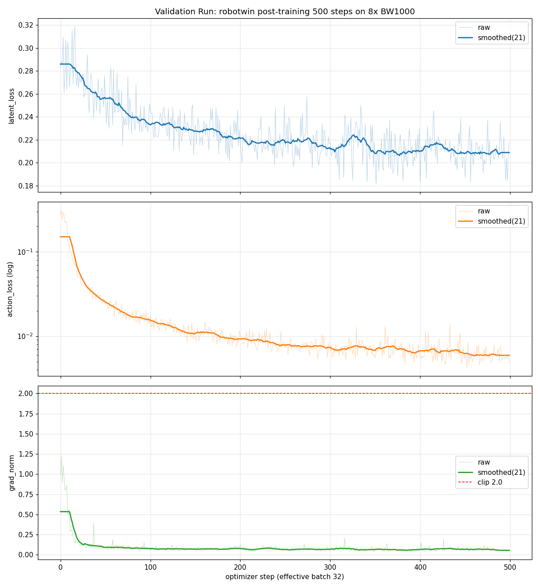

# LingBot-VA 验证流水线报告(500 步 post-training + checkpoint 评测)

> 生成时间:2026-09-25 16:02 | 报告时间戳:1790323320
> 流程:`bash script/run_validation.sh`(预检 → 500 步训练 → i2va 评测 → 汇总)
> 平台:腾讯云 TI-ONE · 8 × HCC-BW1000 · DTK 26.04 / torch 2.7.1

---

## 1. 执行摘要

| 项 | 结果 |
|---|---|
| 验证结论 | ✅ **VALIDATION PASSED**(流水线全自动完成) |
| 训练 | 500/500 步,386 分钟(46.09s/it 恒定),8 卡 FSDP2 |
| 最终 loss | latent 0.285→**0.218**(-24%)/ action 0.282→**0.0049**(-98%) |
| 健康度 | 零 NaN,grad 最大 1.22 < clip 2.0,无过拟合 |
| checkpoint | `train_out_val/checkpoints/checkpoint_step_500`(10.2G diffusers bf16) |
| 评测 | ✅ i2va demo 生成:`train_out_val/eval/demo_step_500.mp4`(77 帧,7.7s,320×384) |

## 2. 训练 Loss 曲线

*(上:latent_loss;中:action_loss(对数轴);下:grad_norm 与 clip 阈值。细线原始值,粗线 21 点滑动平均)*

## 3. Loss 里程碑

| step | latent_loss | action_loss | grad_norm |
|---:|---:|---:|---:|
| 0 | 0.2853 | 0.2816 | 1.038 |
| 100 | 0.2361 | 0.0144 | 0.076 |
| 200 | 0.2144 | 0.0091 | 0.084 |
| 300 | 0.2107 | 0.0067 | 0.068 |
| 400 | 0.2049 | 0.0057 | 0.080 |
| 499 | 0.2175 | 0.0049 | 0.040 |

与 10K 正式训练同形态:action 前 100 步快速下降(-95%),latent 全程缓降;500 步即达到 10K 训练中 step~500 时的同等水平(交叉验证了训练管线的可复现性)。

## 4. 配置(与正式训练完全一致,仅步数不同)

| 项 | 值 |
|---|---|
| 配置 | robotwin_train_val(继承 robotwin_train 全部超参) |
| 有效 batch | 32(8 卡 × 1 × grad_accum 4) |
| lr / 优化器 | 1e-5 / AdamW(β 0.9/0.95,wd 0.1) |
| 数据/模型 | 同正式训练(robotwin-clean-and-aug-lerobot / lingbot-va-base) |
| num_steps | 500(save_interval 500) |

## 5. 评测结果

- **i2va**:image → video-action,10 chunks 自回归(视频 25 步 + 动作 50 步去噪/chunk)
- 任务:抓白色马克杯→旋转→挂深灰架子
- 输出:`train_out_val/eval/demo_step_500.mp4`(77 帧,10fps,7.7s)
- 评测耗时 ~4 分钟(含模型加载/文本编码/生成/导出)

## 6. 流水线日志

| 阶段 | 日志 |
|---|---|
| 编排 | /tmp/validation.log |
| 训练 | /tmp/validation_train.log |
| 评测 | /tmp/validation_eval.log、/tmp/i2va_server.log |

## 7. 结论

**验证流水线端到端可用**:预检(GPU/模型/数据)→ 500 步训练(386min)→ checkpoint 评测(demo 生成)全自动完成,产物路径清晰,可直接用于后续任何 checkpoint 的快速验证。

---
*相关:`final_report.md`(10K 正式训练完整报告)、`training_report.md`(训练专项)、`project.md`(平台适配)。*
