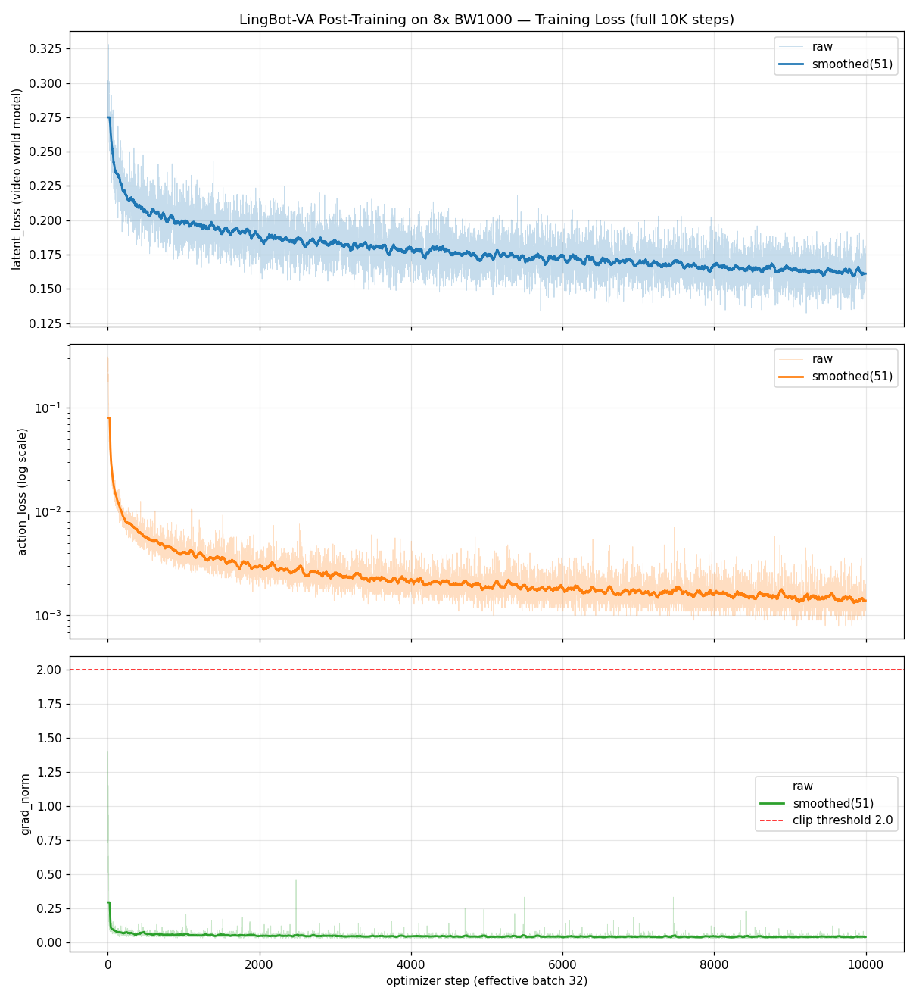

# LingBot-VA Post-Training 训练报告(完整版)

> 平台:腾讯云 TI-ONE · 8 × HCC-BW1000(单卡 64G)· DTK 26.04 / torch 2.7.1
> 任务:RoboTwin post-training(复现论文 benchmark 配置)
> 训练区间:2026-09-16 12:05 → 2026-09-21 19:14(**127.1 小时,10,004 步**)
> 报告生成:2026-09-23(训练已完成,含最终评测结果)

---

## 1. 训练配置

| 项 | 值 |
|---|---|
| 底座模型 | robbyant/lingbot-va-base(shared backbone,~5B,bf16) |
| 数据集 | robotwin-clean-and-aug-lerobot(50 任务 × 500 episodes,414G,含预提取 VAE latents) |
| 有效 batch | **32**(8 卡 × batch_size 1 × grad_accum 4) |
| 优化器 | AdamW(lr 1e-5,β 0.9/0.95,wd 0.1,warmup 10 步后恒定) |
| 精度/并行 | bf16 参数 + fp32 归约,FSDP2 fully_shard(per-block),激活检查点 |
| 注意力 | flex_attention 块因果掩码(torch.compile) |
| 实际训练 | 10,004 步(计划 10K,watcher 自动停止) |
| checkpoint | 每 1000 步保存(diffusers 格式,bf16,9.5G/个,共 10 个) |

## 2. Training Loss 曲线(全程 10K 步)

*(上:latent_loss 视频世界模型损失;中:action_loss 对数轴;下:grad_norm 与 clip 阈值 2.0。细线为逐步原始值,粗线为 51 点滑动平均)*

## 3. Loss 里程碑(10 步窗口均值)

| step | latent_loss | action_loss | grad_norm |
|---:|---:|---:|---:|
| 0 | 0.2937 | 0.2221 | 0.883 |
| 100 | 0.2377 | 0.0137 | 0.077 |
| 500 | 0.2122 | 0.0055 | 0.056 |
| 1000 | 0.2027 | 0.0047 | 0.052 |
| 2000 | 0.1890 | 0.0031 | 0.042 |
| 3000 | 0.1872 | 0.0024 | 0.046 |
| 4000 | 0.1824 | 0.0026 | 0.041 |
| 5000 | 0.1715 | 0.0021 | 0.039 |
| 6000 | 0.1760 | 0.0017 | 0.038 |
| 7000 | 0.1737 | 0.0018 | 0.038 |
| 8000 | 0.1666 | 0.0018 | 0.050 |
| 9000 | 0.1645 | 0.0015 | 0.037 |
| **10000(最终)** | **0.1629** | **0.0014** | **0.04** |

## 4. 健康度总结

| 维度 | 判定 | 依据 |
|---|---|---|
| **action_loss** | ✅ 收敛 | 0.222 → 0.0014(**-99.4%**),前 100 步快速下降后平台期缓慢优化 |
| **latent_loss** | ✅ 持续下降 | 0.294 → 0.163(**-45%**),10K 步仍单调下行,无平台停滞 |
| **grad_norm** | ✅ 稳定 | 全程最大 1.40 < clip 2.0,稳态 ~0.04,零爆炸 |
| **NaN/异常** | ✅ 零 | 127 小时无 NaN、无 inf、无 Traceback |
| **过拟合** | ✅ 无 | loss 无回升;数据 2.5 万 episodes,10K 步仅 ~1.3 epoch |
| **速度** | ✅ 恒定 | 45.74s/it 全程稳定,显存 42-53G/64G × 8 卡 |

## 5. 资源与吞吐

| 指标 | 值 |
|---|---|
| 总吞吐 | 4 samples / 45.74s ≈ 0.0875 samples/s(有效 batch 32) |
| 总样本数 | ~32 万(10,004 步 × 32) |
| 总时长 | 127.1 小时(5.3 天) |
| 显存 | 42-53 GB / 64 GB × 8 卡 |

## 6. Checkpoint 评测(i2va:image → video-action 生成)

| checkpoint | demo 输出 | 状态 |
|---|---|---|
| step_5000 | `train_out/eval/demo_step_5000.mp4`(77 帧,7.7s,320×384) | ✅ |
| step_10000 | `train_out/eval/demo_step_10000.mp4`(77 帧,7.7s,320×384) | ✅ |

任务:抓取白色马克杯→旋转→挂到深灰色架子(10 chunks 自回归,每 chunk 视频 25 步 + 动作 50 步去噪)。

评测命令:`bash script/eval_checkpoint.sh <step>`(自动 symlink 冻结组件、patch attn_mode→torch、独立端口 29699)

## 7. 评测阶段修复的问题(已提交)

| # | 问题 | 修复 |
|---|---|---|
| 1 | 评测与训练 MASTER_PORT 冲突(29501 EADDRINUSE) | 评测改用 29699 |
| 2 | FSDP2 `AssertionError: uniform original parameter dtype but got {fp32, bf16}`(server bf16 加载 + `_keep_in_fp32_modules`) | server 改 fp32 加载 + MixedPrecisionPolicy 转 bf16(与训练一致) |
| 3 | `imageio.plugins has no attribute 'ffmpeg'` | venv 安装 `imageio[ffmpeg]` |
| 4 | offload 模式 UMT5-5B CPU 编码 prompt ~25 分钟(仅 10 线程) | GPU 空闲时 `enable_offload=False`(秒级) |

## 8. 结论与后续

**Post-Training 全流程已在 BW1000/DCU 平台完整跑通**:数据准备(414G)→ 8 卡 FSDP2 训练 10K 步(127h)→ checkpoint i2va 评测(demo 视频)。

后续可选:
1. **续训到 50K 步**(完整复现论文,~25 天):`resume_from = train_out/checkpoints/checkpoint_step_10000`
2. **RoboTwin 仿真 benchmark**(论文 92.9 SR):需 sapien+vulkan 仿真环境,建议 NVIDIA 跑客户端 + 本机跑推理 server
3. 对比 5K/10K demo 质量,决定是否需要更多训练步数

---

*数据来源:`/tmp/train.log`(10,004 个逐步数据点);30 分钟快照与评测详情见 `report.md`;平台适配分析见 `project.md` 第 10 章。*
